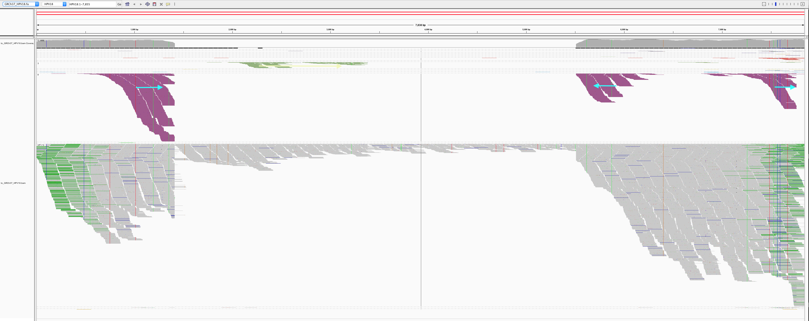
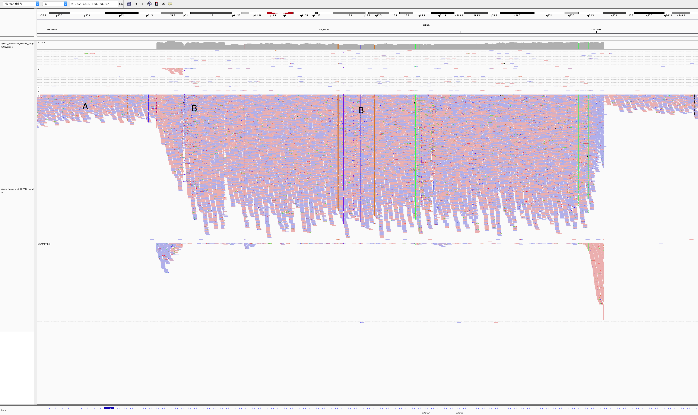

# Oncoviruses in DiploidNeverResponder

* [Extracting unmapped reads](#extracting-unmapped-reads)
* [Exploring taxonomic content](#exploring-taxonomic-content)
* [De-novo assembling HPV18 region](#de-novo-assembling-hpv18-region)
* [DNA Molecule Length Distribution](#dna-molecule-length-distribution)
* [Looking for integration sites](#looking-for-integration-sites)
* [chr8 integration site](#chr8-integration-site)

## Extracting unmapped reads

We want to eplore viruses that might be intergrated into the genome. In order to do that, we start with getting reads unmapped to the human genome, or reads with unmapped mate which can support integration breakpoints.

```
sambamba view -f bam -F "unmapped or mate_is_unmapped" -t 20 diploid_tumor-ready.bam | samtools sort diploid_tumor-unmapped_or_mate.unsorted.bam -n -@ 10 > diploid_tumor-unmapped_or_mate.namesorted.bam
```

Then we filter high quality reads:
- all(q >= 10 for q in read.query_qualities) and mean(read.query_qualities) >= 25
- read.query_length >= 125
- paired

```
./filter_bam_highqual.py diploid_tumor-unmapped_or_mate.namesorted.bam
Total:              28,564,510 out of 2,230,924,710
lng_i:              27,894,774
hqual_i:            15,326,411
lng_hqual_i:        14,878,067
paired_i:           28,564,510
paired_lng_hqual_i: 14,878,067
```

Output written to `lng_hqual/diploid_tumor-unmapped_or_mate.namesorted.bam`. Extracting reads:

```
cd lng_hqual
samtools fastq diploid_tumor-unmapped_or_mate.namesorted.bam -1 diploid_tumor.R1.fq -2 diploid_tumor.R2.fq -s diploid_tumor.single.fq
[M::bam2fq_mainloop] discarded 11217916 singletons
[M::bam2fq_mainloop] processed 14878054 reads
```

## Exploring taxonomic content

Querying the target reads against the oncovirus database. First using a fast k-mer approach to give a quick outline, then using exact BWA-MEM alignment to get reads aligned to particular species.

### Mash

Applying a fast [k-mer based approach](http://mash.readthedocs.io/en/latest/tutorials.html?highlight=screen#screening-a-read-set-for-containment-of-refseq-genomes). First, querying against a oncoviral database from GDC:

```
mkdir mash
mash sketch /g/data3/gx8/extras/vlad/bcbio/genomes/Hsapiens/GRCh37/viral/gdc-viral.fa -i -o mash/gdc-viral
mash screen mash/gdc-viral.msh diploid_tumor.R1.fq diploid_tumor.R2.fq | sort -gr > mash/screen_gdc.tab
head mash/screen_gdc.tab

0.99726   944/1000   100  0             HPV18
0.879223  67/1000     49  4.56495e-199  HPV45
0.876649  63/1000     29  1.50084e-185  HPV97
0.835578  23/1000      5  1.51569e-58   HPV59
0.816057  14/1000     91  3.39476e-33   HPV68
0.816057  14/1000      6  3.39476e-33   HPV85
0.816057  14/1000   3712  3.39476e-33   HPV39
0.816057  14/1000      2  3.39476e-33   HPV20
0.806739  11/1000      4  3.07798e-25   HPV70
0.806739  11/1000      4  3.07798e-25   HPV66
```

HPV18 is an obvious candidate. Querying against a full RefSeq just in case:

```
mash screen mash/refseq.genomes.k21s1000.msh diploid_tumor.R1.fq diploid_tumor.R2.fq | sort -gr > mash/screen_refseq.tab
(took 4:14.57 time with 100% CPU total)

0.996652  932/1000  98  0             GCF_000865665.1_ViralProj15506_genomic.fna.gz   NC_001357.1 Human papillomavirus - 18, complete genome
0.97558   595/1000   1  0             GCF_000819615.1_ViralProj14015_genomic.fna.gz   NC_001422.1 Enterobacteria phage phiX174 sensu lato, complete genome
0.932215  229/1000   1  0             GCF_000913595.1_ViralProj222261_genomic.fna.gz  NC_022518.1 Human endogenous retrovirus K113 complete genome
0.916976  162/1000   2  0             GCF_000287295.1_ASM28729v1_genomic.fna.gz       NC_018417.1 Candidatus Carsonella ruddii HT isolate Thao2000, complete genome
0.887203  81/1000    2  3.28623e-247  GCF_000829155.1_ASM82915v1_genomic.fna.gz       NZ_AP013293.1 Candidatus Sulcia muelleri PSPU DNA, complete genome
```

Confirmed HPV18.

### BWA-MEM

First aligning to the GDC oncoviruses fasta:

```
mkdir viral_mapping
bwa mem -t 10 /g/data3/gx8/extras/vlad/bcbio/genomes/Hsapiens/GRCh37/viral/gdc-viral.fa diploid_tumor.R1.fq diploid_tumor.R2.fq | bamsort inputthreads=10 outputthreads=10 inputformat=sam index=1 indexfilename=viral_mapping/diploid_tumor_viral.bam.bai O=viral_mapping/diploid_tumor_viral.bam
[main] Real time: 38.855 sec; CPU: 333.034 sec
[V] wrote 3666269 alignments

samtools idxstats viral_mapping/diploid_tumor_viral.bam | awk 'BEGIN {OFS="\t"} {print $1, $2, $3, ($2 != 0) ? $3/$2 : 0 }' | sort -nr -k4,4 | head | cols

name     len  mapped  coverage           normilize by dividing by 1173944366/1000000000 = 1.174 billion reads in genome
HPV18    7857  151264  19.2521           16.3987223169
HCV-2    9711   12828  1.32098
HPV71    8037    2661  0.331094
HCV-1    9646    2862  0.296703
HPV82    7870     242  0.0307497
HPV19    7685     212  0.0275862
HPV21    7779      59  0.00758452
HPV20    7757      37  0.00476989
HPV25    7713      34  0.00440814
```

Aligning to HPV18 only to make sure none of the related virus didn't hijacked any reads:

```
samtools faidx /g/data3/gx8/extras/vlad/bcbio/genomes/Hsapiens/GRCh37/viral/gdc-viral.fa HPV18 > viral_mapping/HPV18.fa
bwa index viral_mapping/HPV18.fa

bwa mem -t 10 viral_mapping/HPV18.fa diploid_tumor.R1.fq diploid_tumor.R2.fq | bamsort inputthreads=10 outputthreads=10 inputformat=sam index=1 indexfilename=viral_mapping/to_HPV18.bam.bai O=viral_mapping/to_HPV18.bam

samtools idxstats viral_mapping/to_HPV18.bam | awk 'BEGIN {OFS="\t"} {print $1, $2, $3, ($2 != 0) ? $3/$2 : 0 }'
# HPV18   7857    151271  19.253
```

Getting same 19x coverage, which is a very strong evidence.

## De-novo assembling HPV18 region

Getting reads that map to HPV18 and all their mate that might point us to an integration site:

```
cd /g/data3/gx8/projects/Saveliev_Diploid/lng_hqual/viral_mapping

sambamba view -F "not unmapped or not mate_is_unmapped" -f bam -o to_HPV18.mapped_or_mate.bam to_HPV18.bam
# will fail with segmentation fault, however will generate the output. Alternative option is to `samtools view HPV18` - should do the same.

# Make sure to name-sort reads before feeding into samtools fastq - otherwise the output will be garbage:
samtools sort -n to_HPV18.mapped_or_mate.bam -O bam -o to_HPV18.mapped_or_mate.namesorted.bam

samtools fastq to_HPV18.mapped_or_mate.namesorted.bam -1 to_HPV18.mapped_or_mate.R1.fq -2 to_HPV18.mapped_or_mate.R2.fq -s to_HPV18.mapped_or_mate.single.fq
[M::bam2fq_mainloop] discarded 0 singletons
[M::bam2fq_mainloop] processed 161716 reads
```

Assembling with SPAdes:

```
spades.py --only-assembler -1 to_HPV18.mapped_or_mate.R1.fq -2 to_HPV18.mapped_or_mate.R2.fq -s to_HPV18.mapped_or_mate.single.fq -o spades

# QC the assembly - stats and alignment back to HPV18
quast.py spades/contigs.fasta -R HPV18.fa -o spades/quast --ref-bam to_HPV18.mapped_or_mate.namesorted.bam --no-read-stats --no-sv -1 to_HPV18.mapped_or_mate.R1.fq -2 to_HPV18.mapped_or_mate.R2.fq --debug

# Align contigs to the reference:
minimap2 -a HPV18.fa spades/contigs.fasta | samtools sort > spades/contigs_to_HPV18.bam && samtools index spades/contigs_to_HPV18.bam
```

Reads getting assembled pretty well into 4 long contigs:


All 4 contigs touch each other and cover the assembly fully uniformly, which is a strong evidence of the virus being present in the dataset with possible breakpoints in integration sites. NODE_2, NODE_4 and NODE_4 are amplified heavily up to 5kX coverage, and NODE_1 has a much smaller coverage. The genome is clearly circular - NODE_2 spans the edges, and the breakpoing supported by discordant pairs:


## Looking for integration sites

To identify if the virus is integrated into human, we need to review the viral read whose mates map to the human genome. We would expect reads of forward orienation to pile up to the left of the breakpoint, and reads of the opposite orientation to pile up to the right of the breakpoint; a simmetrical picture would be expected in the human chromosome as well. In order to figure that out, we are creating a GRCh37-HPV18 spike reference, and remap reads against this artificial genome:

```
mkdir GRCh37_HPV18
cat /g/data3/gx8/local/development/bcbio/genomes/Hsapiens/GRCh37/seq/GRCh37.fa > GRCh37_HPV18/GRCh37_HPV18.fa
cat HPV18.fa >> GRCh37_HPV18/GRCh37_HPV18.fa

# Align
bwa index GRCh37_HPV18/GRCh37_HPV18.fa
bwa mem -t 10 GRCh37_HPV18/GRCh37_HPV18.fa to_HPV18.mapped_or_mate.R1.fq to_HPV18.mapped_or_mate.R2.fq | bamsort inputthreads=10 outputthreads=10 inputformat=sam index=1 indexfilename=GRCh37_HPV18/to_GRCh37_HPV18.bam.bai O=GRCh37_HPV18/to_GRCh37_HPV18.bam

OR EVEN (doesn't require index):
minimap2 -ax sr GRCh37_HPV18/GRCh37_HPV18.fa to_HPV18.mapped_or_mate.R1.fq to_HPV18.mapped_or_mate.R2.fq | bamsort inputformat=sam index=1 indexfilename=to_GRCh37_HPV18_mm2.bam.bai O=to_GRCh37_HPV18_mm2.bam
```

HPV18 region of the spiked reference in IGV, sorted by the chromosome of mate. Read direction is annotated with arrows:



There is no very large support for integration, however a bit of evidence from purple (chr8) and green (chr3): reads cluster in viral genome and their mates cluster in human. (for colors, see https://software.broadinstitute.org/software/igv/interpreting_insert_size)

The leftmost purple reads mates are mapping mapping to 8:128,303,800-128,304,900 


The second purple pile in the beginning of NODE_3 has its mates mapping 16kb apart - to 8:128,319,000-128,321,00:


The rightmost purple pile mates is mapping nearby the leftmost pile - to 8:128,307,000-128,308,000


It's possible that the deeply-covered part of the virus got inserted somehow into chromosome 8.

Also, the green reads map to 3:186,691,636-186,699,490, suggesting possible another integration site. There might be also another strain of virus which is less abundant, but integrates to chromosome 3. Worth exploring other viral sequences to confirm - spiking GRCh37 with the whole GDC database and realigning all human-unmapped reads.

Also, it's interesting that blasting the contigs against human sequences, it reports 18% coverage by the human chr8 alternative assembly, as well as by GRCh38:


It's worth exploring whole alignment to GRCh38.

## chr8 integration site

The read orientations spanning the breakpoints suggests a quite complex event rather than a simple insertion of the virus. Exploring the full 16kb GRCh37 region covering all 3 breakpoints:

```
~/bin/sambamba slice 8:128318910-128321289 diploid_tumor-ready.bam > diploid_tumor-chr8_HPV18.bam
```



We can see that 2 of the breakpoint positions are very clear, and it's also evident that:

- The NODE2-3-4 region is amplified heavily instead of being deleted, meaning that the virus didn't replace the region with itself,
- The breakpoints tell us that the viruses amplified region got attached to the rightmost chr8 breakpoint, then looped around and attached to one of the left chr8 breakpoints.

It suggests that the virus created a loop that amplified the 16kb region multiple times, looping the leftmost-rightmost breakpoint chr8 region, likely occasionally attaching to the inner left breakpoint as well. Indeed, things like that happen with HPV viruses often:


The integration site overlaps long non-coding RNA genes CASC21 (Cancer Susceptibility 21, CARLo-2) and CASC8 (Cancer Susceptibility 8, CARLo-1) in their introns. Both genes are associated with cancer.

8q24.21 is known as HPV integration site hotspot: https://www.ncbi.nlm.nih.gov/pmc/articles/PMC4695887/, https://www.ncbi.nlm.nih.gov/pubmed/1649348/: "We have determined the chromosomal localization of integrated HPV type 16 (HPV-16) or HPV-18 genomes in genital cancers... In three cancers, HPV sequences were localized in chromosome band 8q24.1, in which the c-myc gene is mapped... In three of the four cases, the proto-oncogene located near integrated viral sequences was found to be structurally altered and/or overexpressed. These data indicate that HPV genomes are preferentially integrated near myc genes in invasive genital cancers and support the hypothesis that integration plays a part in tumor progression via an activation of cellular oncogenes.", https://www.nature.com/articles/1207006: "RS–PCR of HPV18-positive tumors revealed a single large cluster at 8q24."

----

## Playground

#### chr3 integration site

```
~/bin/sambamba slice diploid_tumor-ready.bam 3:186,691,636-186,699,490 > diploid_tumor-chr3_HPV18.bam
```


Not clear about this one.

#### Aligning to GRCh38

#### Structural variants in this genome location

#### Expreriment with 10x data

