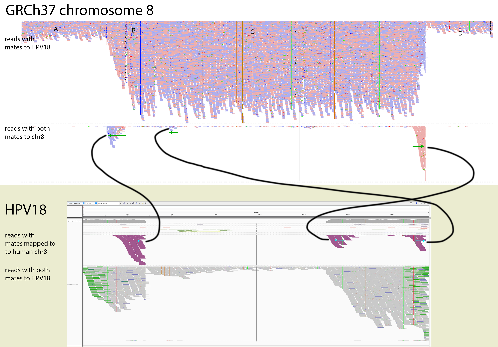
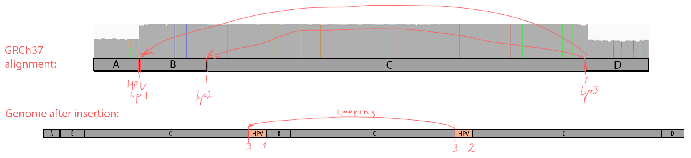
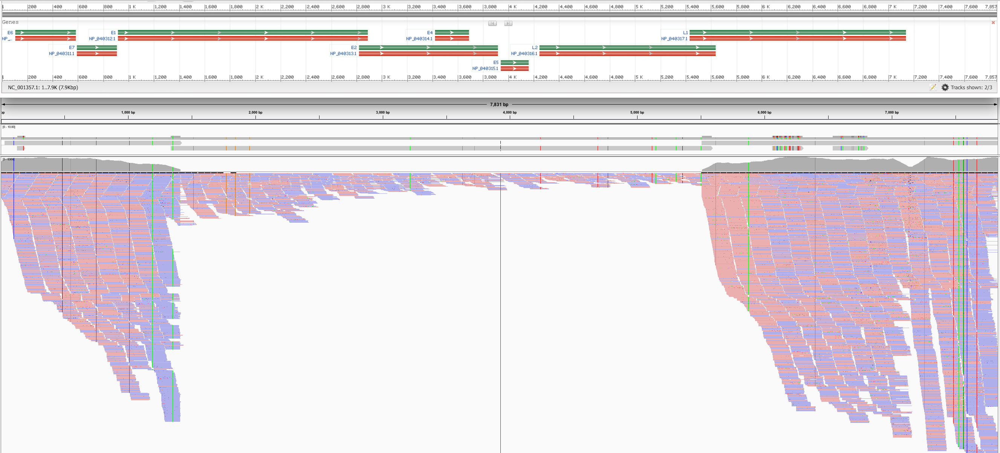

# Oncoviral integration in cervical never-responder

A patient with a possible very atypical cervical carcinoma has not responded to any standard therapies. There were no obvious oncogenic drivers, however the whole genome NGS analysis showed possible HPV content, the virus that is often associated with cervical cancers. Here we explore the viral sequences in this sample and their oncogenicity.


## Exploring taxonomic content

We performed whole genome sequencing at ~80x depth of coverage on average, and aligned the reads to the human genome build GRCh37 with BWA-MEM, using the bcbio-nextgen analysis workflow.

Oncoviruses like HPV usually cause malignancies by integrating into host's DNA, and in NGS alignment data they appear as structural variations with novel sequences supposedly supported by unmapped reads. Such novel insertions cannot be reconstructed only by read alignment because of the viral parts that do not belong to the reference. Thus, as a next step we extraced the reads analigned to the human genome, and additionally added the reads with unmapped mates that can possibly point to the integration breakpoints.

Then we queried the target reads against a database of oncoviruses, acquired from [Genomics Data Commons](https://gdc.cancer.gov/about-data/data-harmonization-and-generation/gdc-reference-files). We've done that by mapping selected reads with BWA-MEM against those viral sequences, and selecting those with high read support. Specifically, we select sequences with the highest coverage completeness at 5x of depth. Some viral sequences contain repetitive regions that attract lots of reads, so we wanted to make sure that the enough percentage of the viral sequence is covered.

In this sample, the only one confiently detected oncovirus is HPV18:

```                       completeness at coverage
name     len   mean depth   1x    5x   25x
HPV18  7857bp  2265x      100%  100%   93%
```

## De novo assembly of HPV18

We used the unmapped reads to feed them into a de novo genome assembler SPAdes. Resulting contigs we aligned back to the reference and analysed with QUAST. Reads getting assembled pretty well into 4 long contigs (NODE 1 through 4):


All 4 contigs together evenly cover the whole reference sequence. NODE\_2, NODE\_3 and NODE\_4 are amplified heavily up to 5kX coverage, and NODE\_1 has a significantly lower coverage. The genome is clearly circular - NODE\_2 spans the edges, and the breakpoing supported by discordant pairs as evident in IGV:


The fact that all contigs overlap slightly but were not merged together into single long contig, suggests that there were possible structural rearrangements, probably due to the human genome integration.


## Finding integration sites

To identify if the virus was integrated into human, we find the reads that map to the virus and have mates mapping to the human genome. We would expect reads of forward orientation to pile up to the left of the breakpoint, and reads of the opposite orientation to pile up to the right of the breakpoint; a simmetrical picture would be expected on the human chromosome as well. In order to visualize it in IGV, we made a "chimeric" reference genome by adding HPV18 as another choromosome into GRCh37, and remapped the viral reads against this assembly.

Below is the HPV18 region in IGV with reads groupped by the mate chromosome (based on [the color scheme](https://software.broadinstitute.org/software/igv/interpreting_insert_size), the small green group is from chromosome 3, the large purple group is from chromosome 8, and all gray read pairs are entirely mapped to HPV18). The read direction is annotated with blue arrows.


There is a quite evident support for human genome integration to chromosome 8 (with purple reads), and a smaller support for the chromosome 3 integration with the green reads. All reads in each colored pile have the same direction, and their mates simmetrically cluster in GRCh37.

The leftmost purple reads mates are mapping mapping to 8:128,303,800-128,304,900. The second rightmost purple pile in the beginning of NODE\_3 has its mates mapping 16kb apart downstream: to 8:128,319,000-128,321,000. The rightmost purple pile mates is mapping 3kb downstream from the leftmost pile - to 8:128,307,000-128,308,000.



This suggests that the deeply covered NODE\_2–NODE\_3–NODE\_4 part of the virus got inserted into chromosome 8.

Worth noting that the green reads map to 3:186,691,636-186,699,490, suggesting another possible integration site. However the integration is not so clear, so we are focusing just on the chr8 integration for now.
	

## Chromosome 8 integration site

The read orientations spanning the breakpoints suggest a quite complex event rather than a simple insertion of the virus. Exploring the full 16kb GRCh37 region covering all 3 breakpoints:
	


We can see that 2 of the breakpoint positions show up very clearly, and it's also evident that:

- The NODE\_2–NODE\_3–NODE\_4 region is amplified heavily instead of being deleted, meaning that the virus didn't replace the region with itself, resulting in some more complex event;

- The read orientations tell us that the viral amplified region got attached to the rightmost chr8 breakpoint from the right side, and to the left breakpoints from the left side, which rejects the idea of a simple insertion;

- chr8 region between the breakpoints is heavily amplified, at roughly the same coverage as the viral amplified regon.

That suggests that the virus created a loop by attaching to the leftmost and the rightmost breakpoints, and this loop is going around multiple times heavily amplifying the chr8 16kb region as well as the viral region NODE\_2–NODE\_3–NODE\_4. While looping, it also likely occasionally got attached to the inner left breakpoint instead of the leftmost one. Indeed, things like this are typical for HPV viruses, e.g. see [Akagi et al.](https://www.ncbi.nlm.nih.gov/pmc/articles/PMC3912410/figure/F4/).

In our case, the integration events might have led to the following sequence:

```
A - B - C - (NODE_4-NODE_3-NODE_2 - B - C)*~10 - NODE_4-NODE_3 - C - D
```

Regions A, B, C, D are parts of the human reference according to the IGV screenshot in the beginning of the section; NODE\_1, NODE\_2, NODE\_3, NODE\_4 are viral contigs according the earlier sections. 



### Host genes

The integration site overlaps long non-coding RNA genes CASC21 (Cancer Susceptibility 21, CARLo-2) and CASC8 (Cancer Susceptibility 8, CARLo-1) in their introns. Both genes are associated with cancer, and located in a region 8q24.21 nearby the oncogene MYC, which is amplified in this sample.

The 8q24.21 location is well known as an HPV integration site hotspot [[1](https://www.ncbi.nlm.nih.gov/pmc/articles/PMC4695887), [2](https://www.ncbi.nlm.nih.gov/pubmed/1649348/), [3](https://www.nature.com/articles/1207006)]:

> In genital cancers, HPV sequences were localized in chromosome band 8q24.1, in which the c-myc gene is mapped. In three of the four cases, the proto-oncogene located near integrated viral sequences was found to be structurally altered and/or overexpressed. These data indicate that HPV genomes are preferentially integrated near myc genes in invasive genital cancers and support the hypothesis that integration plays a part in tumor progression via an activation of cellular oncogenes.

That supports the suggestion of patient's cervical carcinoma, that is nearly always [caused by HPV16 and HPV18](http://www.who.int/mediacentre/factsheets/fs380/en/). We as well observe a somatic MYC amplification detected by a copy number variation CNVkit.

## HPV18 oncogenes

Among total eight HPV18 genes, two act as oncogenes: E6 and E7. [Akagi et al.](https://www.ncbi.nlm.nih.gov/pmc/articles/PMC3912410):

> The transforming ability of oncogenic HPV types has been attributed to two viral oncoproteins, E6 and E7, which inactivate p53 and members of the pRb family.

> HPV integrants in cervical cancers have been statistically associated with regional structural abnormalities, but the relationship of the virus to such variants, their detailed genomic structures, and their functional significance remain largely unknown. 

[Chaturvedi et al.](https://link.springer.com/chapter/10.1007%2F978-1-4419-1472-9_5):

> The E6/E7 proteins inactivate two tumor suppressor proteins, p53 (inactivated by E6) and pRb (inactivated by E7).

E2 regulates E6 and E7, however the viral integration usually disrupts it. [Scheurer et al.](https://onlinelibrary.wiley.com/doi/abs/10.1111/j.1525-1438.2005.00246.x):

> Viral early transcription subjects to viral E2 regulation and high E2 levels repress the transcription. HPV genomes integrate into host genome by disruption of E2 ORF, preventing E2 repression on E6 and E7. Thus, viral genome integration into host DNA genome increases E6 and E7 expression to promote cellular proliferation and the chance of malignancy. The degree to which E6 and E7 are expressed is correlated with the type of cervical lesion that can ultimately develop.

[Mcbride et al](https://www.researchgate.net/figure/HPV18-genome-The-circular-dsDNA-genome-of-HPV18-7-857-bp-is-shown-Viral-open-reading_fig1_236977461):

> The viral genome is most often integrated in such a way as to disrupt the E2 gene and, thus, alleviate transcriptional repression of the early viral promoter. In turn, this causes dysregulation of the E6 and E7 oncogenes and promotes malignant progression


By overlaying [HPV18 genes](https://www.ncbi.nlm.nih.gov/gene/1489088) on coverage, we can see that E6 and E7 are amplified heavily:



And even though the integration breakpoints site don't disrupt E2, that part is not integrated into human genome, and thus not amplified and likely not expressed. 

It would be interesting to perform RNAseq on this sample and quantify the expression of viral genes E6, E7, E2, as well as human MYC, TP53, and RB1. Additionally, MYC significantly upregulates genes with already high expression, so it would be interesting to look for other overexpressed genes.

## Discussion

One interesting obervation comes from blasting the contigs against all human sequences: it reports 18% coverage in a chr8 alternative assembly, and same 18% in hg38:


It would be interesting to perform the same experiment with hg38.

### References

[1](https://www.ncbi.nlm.nih.gov/pmc/articles/PMC395710/pdf/520275.pdf)

[2](https://www.ncbi.nlm.nih.gov/pmc/articles/PMC3912410/)


