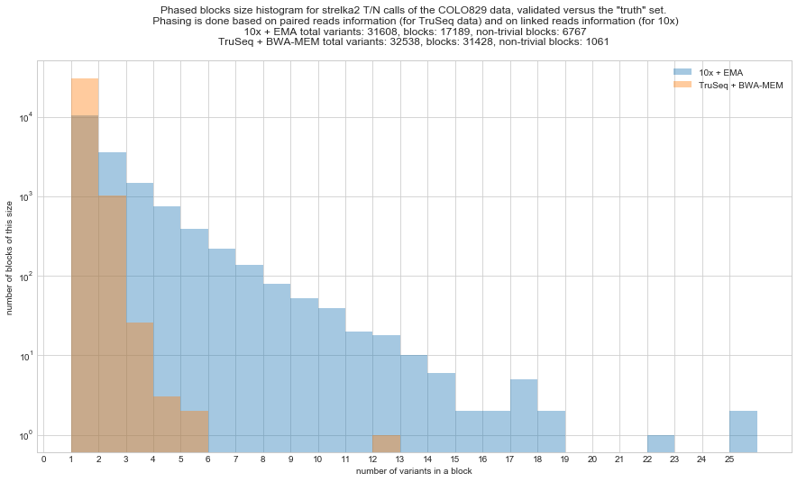
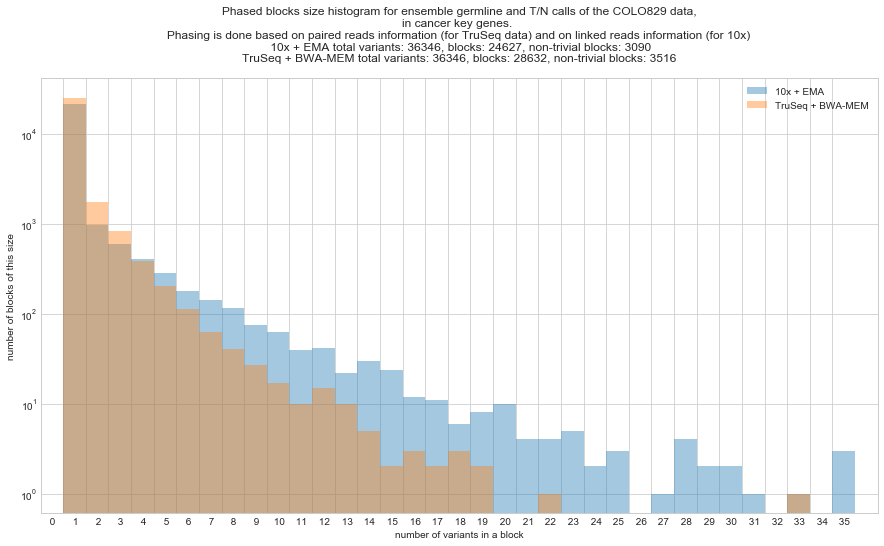
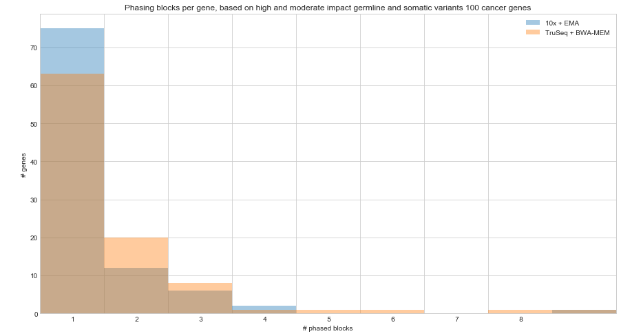

## HapCUT2

To phase the variants, we use [HapCUT2](https://github.com/vibansal/HapCUT2) that can phase both on linked reads (for 10x data) and paired information (for TruSeq data). 

To phase all dilution series both EMA and TruSeq, we prepared a [Snakefile](Snakefile) (see in this repo) that can be run on Raijin cluster (see a finished run in `/home/563/vs2870/gx8/data/10X/Phasing/full_run`). 
It contains the [10x HapCUT2 steps](https://github.com/vibansal/HapCUT2#10x-genomics-linked-reads) and [normal paired read steps](https://github.com/vibansal/HapCUT2#to-run), 
plus a [fgbio tool HapCutToVcf](https://github.com/fulcrumgenomics/fgbio#list-of-tools) to convert HAPCUT2 output back into a phased VCF (and populate the `GT` and `PS` FORMAT tags).

The generated phasing blocks are plotted with the Jypter notebook [Plot phase blocks.ipynb]("Plot phase blocks.ipynb").

Somatic variants:



Somatic+germline variants in 100 key genes:



Phased blocks per gene in key genes (only high/moderate impact, somatic+germline, in 100 key genes), first 10 bins. 10x has a lower mean block size (1.89 vs 2.16), which is good.



From the plot above, it looks like the linked reads barely help to phase. But in fact it works well to phase together somatic variants with surrounding germline calls.

- TruSeq: among 8 true positive high/moderate impact somatic variants in key genes, 1 phase together with 2 high/moderate germline variants. 

- EMA: in 7 variants, even 6 phase together with some germline calls, 4 of which phase with high/moderate impact germline variants (3, 2, 2, 1 correspondingly)


### Making the pipeline

```
cd /home/563/vs2870/gx8/data/10X/Phasing/test_small
```

Script `run.sh` will phase a 10x VCF file.

It contains of several HAPCUT2 steps according to https://github.com/vibansal/HapCUT2#10x-genomics-linked-reads
Plus a fgbio tool to convert HAPCUT2 output back into a phased VCF: https://github.com/fulcrumgenomics/fgbio#list-of-tools -> HapCutToVcf

### Testing on chr21

Subsetting a 100pc EMA BAM file

```
ln -s /home/563/vs2870/gx8/data/10X/10X_EMA/bcbio_original/final/2018-07-14_10X-Collaboration_EMA/COLO829_100pc-batch-ensemble-annotated.vcf.gz EMA_COLO829_100pc-ensemble.vcf.gz

# Uncompressed VCF file is required. Tricks like <(gunzip -c ...vcf.gz) or <(bcftools view ...vcf.gz) for some reason won't work
bcftools view -f.,PASS EMA_COLO829_100pc-ensemble.vcf.gz 21 > EMA_COLO829_100pc-ensemble.21.vcf

ln -s /home/563/vs2870/gx8/projects/Saveliev_10X/COLO829-10x/ema_trimmed_runs/ema_COLO829_100pc/COLO829_100pc.bam
samtools view -O BAM COLO829_100pc.bam 21 > COLO829_100pc.21.bam
samtools index COLO829_100pc.21.bam
```

Running

```
bash run.sh results/EMA_ EMA_COLO829_100pc-ensemble.21.vcf EMA_COLO829_100pc.21.bam
```

Does't work on ensemble calls. Trying strelka2:

```
ln -s /home/563/vs2870/gx8/data/10X/10X_EMA/bcbio_original/final/2018-07-14_10X-Collaboration_EMA/COLO829_100pc-batch-strelka2-annotated.vcf.gz EMA_COLO829_100pc-strelka2.vcf.gz
bcftools view -f.,PASS EMA_COLO829_100pc-strelka2.vcf.gz 21 > TruSeq_COLO829_100pc-strelka2.21.vcf

bash run.sh results/EMA_ EMA_COLO829_100pc-strelka2.21.vcf EMA_COLO829_100pc.21.bam
```

Works good.

Now comparing against a non-10x run. Subsetting:

```
ln -s /home/563/vs2870/gx8/data/10X/TruSeq/bcbio_original/final/2018-07-15_10X-Collaboration_WGS-merged/COLO829_100pc-batch-strelka2-annotated.vcf.gz TruSeq_COLO829_100pc-strelka2.vcf.gz
bcftools view -f.,PASS TruSeq_COLO829_100pc-strelka2.vcf.gz 21 > TruSeq_COLO829_100pc-strelka2.21.vcf

ln -s /g/data3/gx8/data/10X/TruSeq/bcbio_original/BAMs/Colo829-ready.bam
samtools view Colo829-ready.bam 21 -O BAM > Colo829-ready.21.bam
samtools index Colo829-ready.21.bam
```

Running slightly different workflow `run_TruSeq.sh`:

```
bash run_TruSeq.sh results/TruSeq_ TruSeq_COLO829_100pc-strelka2.21.vcf TruSeq_COLO829_100pc.21.bam
```

Doesn't work on TruSeq calls. Maybe need some clean up, like ensemble. Trying on EMA calls:

```
bash run_TruSeq.sh results/No10x_ EMA_COLO829_100pc-strelka2.21.vcf EMA_COLO829_100pc.21.bam
```

All good.

Without using linked reads, the output looks like this, e.g. many discontiguous haplotype blocks, based on paired read evidence.

```
BLOCK: offset: 8 len: 2 phased: 2 SPAN: 335 fragments 4
8       0       0       21      15790332        T       A       0/0:68:0:0:0:0,0:0,0:0,0:68,74:0        0       .       100.00
9       0       0       21      15790667        G       A       0/0:26:0:0:0:0,0:0,0:26,31:0,0:0        0       .       100.00
********
BLOCK: offset: 68 len: 3 phased: 2 SPAN: 112 fragments 11
68      0       0       21      18752886        T       C       0/0:42:0:0:0:0,0:0,0:0,0:42,56:0        0       .       100.00
70      0       0       21      18752998        C       G       0/0:38:1:0:0:0,0:37,46:0,0:0,0:0        0       .       100.00
********
BLOCK: offset: 71 len: 2 phased: 2 SPAN: 297 fragments 7
71      0       0       21      19014982        C       T       0/0:44:0:0:0:1,1:43,45:0,0:0,0:0        0       .       100.00
72      0       0       21      19015279        G       A       0/0:38:0:0:0:0,0:0,0:38,40:0,0:0        0       .       100.00
********
BLOCK: offset: 75 len: 2 phased: 2 SPAN: 2 fragments 26
75      0       0       21      19076975        G       A       0/0:34:0:0:0:0,0:0,0:34,38:0,0:0        0       .       100.00
76      0       0       21      19076977        G       A       0/0:33:0:0:0:0,0:0,0:33,37:0,0:0        0       .       100.00
********
BLOCK: offset: 140 len: 2 phased: 2 SPAN: 1 fragments 46
140     0       0       21      21870697        C       A       0/0:62:0:0:0:0,0:62,70:0,0:0,0:0        0       .       100.00
141     0       0       21      21870698        C       T       0/0:62:0:0:0:0,0:62,70:0,0:0,0:0        0       .       100.00
********
BLOCK: offset: 172 len: 3 phased: 3 SPAN: 135 fragments 49
172     0       0       21      22943341        T       G       0/0:48:0:0:0:0,0:0,0:0,0:48,54:0        0       .       100.00
173     0       0       21      22943348        C       A       0/0:52:0:0:0:0,1:52,57:0,0:0,0:0        0       .       100.00
174     0       0       21      22943476        C       T       0/0:56:0:0:0:0,0:56,60:0,0:0,0:0        0       .       7.00
********
BLOCK: offset: 218 len: 2 phased: 2 SPAN: 497 fragments 4
218     0       0       21      24511717        C       T       0/0:54:1:0:0:0,0:53,57:0,0:0,0:0        0       .       100.00
219     0       0       21      24512214        G       A       0/0:37:0:0:0:0,0:0,0:37,42:0,0:0        0       .       100.00
********
```

When the linked reads information, getting some longer contiguous haplotype blocks:

```
BLOCK: offset: 4 len: 2 phased: 2 SPAN: 35415 fragments 1
4       0       0       21      15708616        G       A       0/0:64:0:0:0:1,1:0,0:63,71:0,0:0.015625 0       .       61.64
5       0       0       21      15744031        G       A       0/0:24:1:0:0:0,0:0,0:23,25:0,0:0        0       .       61.64
********
BLOCK: offset: 6 len: 6 phased: 5 SPAN: 22927 fragments 32
6       0       0       21      15781071        G       A       0/0:30:1:0:0:0,0:0,0:29,33:0,0:0        0       .       100.00
8       0       0       21      15790332        T       A       0/0:68:0:0:0:0,0:0,0:0,0:68,74:0        0       .       100.00
9       0       0       21      15790667        G       A       0/0:26:0:0:0:0,0:0,0:26,31:0,0:0        0       .       100.00
10      0       0       21      15799235        C       T       0/0:29:0:0:0:0,0:29,31:0,0:0,0:0        0       .       100.00
11      0       0       21      15803998        G       A       0/0:33:1:0:0:0,0:0,0:32,33:0,0:0        0       .       100.00
********
BLOCK: offset: 12 len: 2 phased: 2 SPAN: 23852 fragments 5
12      0       0       21      15825790        G       A       0/0:53:1:0:0:0,0:0,0:52,55:0,0:0        0       .       100.00
13      0       0       21      15849642        G       A       0/0:43:0:0:0:0,0:0,0:43,47:0,0:0        0       .       100.00
********
BLOCK: offset: 21 len: 2 phased: 2 SPAN: 5965 fragments 15
21      0       0       21      16950076        G       A       0/0:50:0:0:0:0,0:0,0:50,55:0,0:0        0       .       100.00
22      0       0       21      16956041        G       A       0/0:46:0:0:0:0,0:0,0:46,48:0,0:0        0       .       100.00
********
BLOCK: offset: 26 len: 10 phased: 10 SPAN: 118186 fragments 56
26      0       0       21      17324746        T       C       0/0:47:0:0:0:0,0:1,1:0,0:46,58:0.0212766        0       .       100.00
27      0       0       21      17326745        A       C       0/0:53:0:0:0:52,54:0,0:0,0:1,1:0        0       .       100.00
28      0       0       21      17331231        G       T       0/0:35:0:0:0:0,0:0,0:35,38:0,0:0        0       .       100.00
29      0       0       21      17359885        A       C       0/0:28:0:1:0:28,28:0,0:0,0:0,0:0        0       .       100.00
30      0       0       21      17391998        A       G       0/0:67:0:0:0:66,71:1,1:0,0:0,0:0        0       .       100.00
31      0       0       21      17401816        C       A       0/0:29:0:0:0:0,0:29,29:0,0:0,0:0        0       .       100.00
32      0       0       21      17408545        T       C       0/0:36:0:0:0:0,0:0,0:0,0:36,39:0        0       .       100.00
33      0       0       21      17422069        C       T       0/0:43:0:0:0:0,0:43,51:0,0:0,0:0        0       .       100.00
34      0       0       21      17439383        C       T       0/0:40:0:0:0:0,0:40,43:0,0:0,0:0        0       .       100.00
35      0       0       21      17442932        G       A       0/0:78:2:0:0:0,0:0,0:76,81:0,1:0        0       .       100.00
********
BLOCK: offset: 68 len: 3 phased: 2 SPAN: 112 fragments 17
```

But still worrying that we can't use TruSeq VCF fille. Trying on downsampled TruSeq:

```
ln -s /g/data/gx8/data/10X/TruSeq/bcbio_original/BAMs/Colo829-ready_downsample.bam TruSeq_COLO829_100pc_downsample.bam
ln -s /g/data/gx8/data/10X/TruSeq/bcbio_downsampled/final/2018-07-17_10X-Collaboration_downsample/COLO829_100pc-downsample-batch-strelka2-annotated.vcf.gz TruSeq_COLO829_100pc_downsample-strelka2.vcf.gz

bcftools view -f.,PASS TruSeq_COLO829_100pc_downsample-strelka2.vcf.gz 21 > TruSeq_COLO829_100pc_downsample-strelka2.21.vcf.gz

samtools view TruSeq_COLO829_100pc_downsample.bam 21 -O BAM > TruSeq_COLO829_100pc_downsample.21.bam
samtools index TruSeq_COLO829_100pc_downsample.21.bam

bash run_TruSeq.sh results/TruSeq_downsample_ TruSeq_COLO829_100pc_downsample-strelka2.21.vcf.gz TruSeq_COLO829_100pc_downsample.21.bam
```

Better now:

```
BLOCK: offset: 8 len: 2 phased: 2 SPAN: 335 fragments 6
8       0       0       21      15790332        T       A       0/0:40:0:0:0:0,0:0,0:0,0:40,40:0        0       .       100.00
9       0       0       21      15790667        G       A       0/0:49:0:0:0:0,0:0,0:49,49:0,0:0        0       .       100.00
********
BLOCK: offset: 61 len: 2 phased: 2 SPAN: 297 fragments 9
61      0       0       21      19014982        C       T       0/0:45:0:0:0:1,1:44,44:0,0:0,0:0        0       .       100.00
62      0       0       21      19015279        G       A       0/0:35:0:0:0:0,0:0,0:35,35:0,0:0        0       .       100.00
********
BLOCK: offset: 64 len: 2 phased: 2 SPAN: 2 fragments 34
64      0       0       21      19076975        G       A       0/0:39:0:0:0:0,0:0,0:39,39:0,0:0        0       .       100.00
65      0       0       21      19076977        G       A       0/0:39:0:0:0:0,0:0,0:39,39:0,0:0        0       .       100.00
********
BLOCK: offset: 124 len: 2 phased: 2 SPAN: 1 fragments 34
124     0       0       21      21870697        C       A       0/0:30:0:0:0:0,0:30,30:0,0:0,0:0        0       .       100.00
125     0       0       21      21870698        C       T       0/0:30:0:0:0:0,0:30,30:0,0:0,0:0        0       .       100.00
********
BLOCK: offset: 194 len: 2 phased: 2 SPAN: 497 fragments 3
194     0       0       21      24511717        C       T       0/0:41:0:0:0:0,0:41,41:0,0:0,0:0        0       .       100.00
195     0       0       21      24512214        G       A       0/0:46:0:0:0:0,0:0,0:46,47:0,0:0        0       .       100.00
********
BLOCK: offset: 198 len: 2 phased: 2 SPAN: 402 fragments 6
198     0       0       21      24597761        G       A       0/0:37:0:0:0:0,0:0,0:37,37:0,0:0        0       .       100.00
199     0       0       21      24598163        T       G       0/0:47:0:0:0:0,0:0,0:0,0:47,47:0        0       .       100.00
********
BLOCK: offset: 256 len: 2 phased: 2 SPAN: 1 fragments 39
256     0       0       21      26638431        G       A       0/0:37:0:0:0:0,0:0,0:37,37:0,0:0        0       .       100.00
257     0       0       21      26638432        G       A       0/0:37:0:0:0:0,0:0,0:37,37:0,0:0        0       .       100.00
********
```

However after poking, figuring out that the reason it didn't run on some VCFs was that the VCFs have 2 samples, so need to extract one with:

```
bcftools view -s Colo829_80pc_downsample ensemble.vcf > ensemble.sample.vcf
```

Also, to compare more apple-to-apple, filtering all variants only to true possives with:

```
bcftools isec TruSeq_100pc-downsample-strelka2.phased.vcf.gz EGAZ00001226241_ListforNatureReports.IndelsandSNVs.final.Suppl1.snpEff.validated.SORTED.vcf.gz -p isec_bwa -n=2 -w1
# writes to isec_bwa/0001.vcf
```

Also, the `.hap` files contain only non-trivial phasing groups. To plot all variants, we need to convert back to VCF, and use the `PS` FORMAT tags (that contain the phasing group ID).

All these steps are a part of the [Snakefile](Snakefile).

### Adding germline

Somatic variants are sparce, but we want to undestand if we can phase together germline and somatic variants within a gene. We modify the Snakefile to include germline variants
from the blood control sample, however for performance reasons we subset all varaints to key genes only (from 3m to 30k). There are only 300 somatic variants in key genes, so we can as well ignore them.

Also, some germline variants have dots in `GT` fields, which leads `extractHAIRS` to error out with:

```
ERROR: Non-diploid VCF entry detected. Each VCF entry must have a diploid genotype (GT) field consisting of two alleles in the set {0,1,2} separated by either '/' or '|'. For example, "1/1", "0/1", and "0|2" are valid diploid genotypes for HapCUT2, but "1", "0/3", and "0/0/1" are not.
The invalid entry is:
```

Adding a line to filter out those into the Snakemake:

```
bcftools filter -e "GT=='.|.' | GT=='.|1' | GT=='1|.' | GT=='1'" 
```

### Ideas: 
- Germline varaints were called from a normal sample, so we can improve phasing by combining phasing information from both tumor and blood BAMs.

